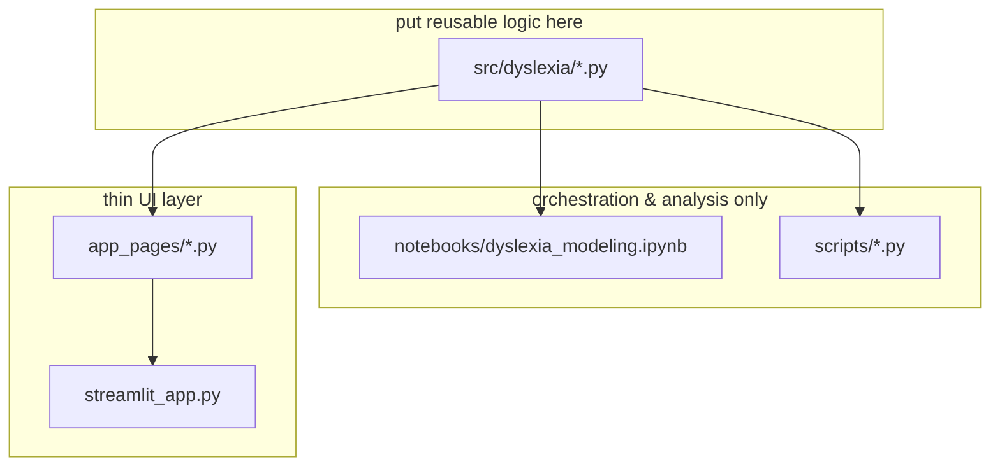

# Contributing

Thanks for your interest in improving **Dyslexia Detection from Handwriting**.
This is a research demo, so contributions that improve rigor, reproducibility,
honesty about limitations, and code quality are especially welcome.

> [!IMPORTANT]
> This project screens for dyslexia‑related handwriting patterns. It is **not a
> medical device**. Please keep every user‑facing string, notebook conclusion,
> and metric framed as an *exploratory indicator*, never a diagnosis.

---

## Table of contents

- [Code of conduct](#code-of-conduct)
- [Ways to contribute](#ways-to-contribute)
- [Development setup](#development-setup)
- [Project structure & where things go](#project-structure--where-things-go)
- [Coding standards](#coding-standards)
- [Tests](#tests)
- [Working with models & data](#working-with-models--data)
- [Commit & branch conventions](#commit--branch-conventions)
- [Pull request checklist](#pull-request-checklist)
- [Reporting bugs](#reporting-bugs)
- [Proposing features](#proposing-features)
- [License of contributions](#license-of-contributions)

---

## Code of conduct

Be respectful and constructive. Assume good faith. Harassment, discrimination,
or dismissive behavior toward contributors or toward the population this project
concerns (people with dyslexia) is not tolerated. Maintainers may edit, lock, or
remove contributions that violate this.

---

## Ways to contribute

| Type | Examples |
|---|---|
| **Bug fixes** | Crashes, wrong blend maths, OCR edge cases, path resolution on Windows |
| **Tests** | Cover an untested branch, add regression tests for a fixed bug |
| **Docs** | Clarify methodology, fix a diagram, improve setup instructions |
| **Model quality** | Better calibration, regenerating features with the offline pipeline, closing the [feature‑drift gap](README.md#datasets) |
| **Robustness** | Graceful degradation when a dependency or weight file is missing |
| **Ethics & fairness** | Bias analysis, abstention logic, clearer disclaimers |

Large changes (new models, new datasets, architecture shifts) — please open an
issue to discuss **before** writing code.

---

## Development setup

```bash
git clone https://github.com/srummanf/Dyslexia-Detection-from-Handwriting.git
cd Dyslexia-Detection-from-Handwriting

python -m venv .venv
source .venv/bin/activate            # Windows: .venv\Scripts\activate

pip install -e ".[app,nlp,dev]"      # add ocr,vision,explain if you need them
python scripts/train_tabular.py      # rebuild models/tabular/model.joblib
pytest                               # confirm a clean baseline
```

`pip install -e ".[dev]"` gives you `pytest`, `ruff`, and `jupyter`. The heavy
extras (`ocr` → easyocr/torch, `vision` → ultralytics/timm) are only needed if
your change touches those code paths.

---

## Project structure & where things go



| If you're changing… | Edit | Not |
|---|---|---|
| How a feature is computed | `src/dyslexia/features.py` | the notebook |
| Model candidates / selection | `src/dyslexia/tabular.py` | `scripts/train_tabular.py` |
| How signals are blended | `src/dyslexia/screener.py` | `app_pages/` |
| OCR backends | `src/dyslexia/ocr.py` | — |
| A Streamlit page | `app_pages/*.py` (keep it thin — call into `dyslexia.*`) | `src/dyslexia/` |
| Paths / weights / blend weights | `config.yaml` | hard‑coded constants |

**Rule of thumb:** if it could be unit‑tested, it belongs in `src/dyslexia/`, not
in a page or a notebook cell.

---

## Coding standards

- **Python ≥ 3.10**, `from __future__ import annotations` at the top of every module.
- **`ruff`** is the linter and formatter. Config lives in `pyproject.toml`
  (line length 100, `py310` target). Run before committing:
  ```bash
  ruff format .
  ruff check .
  ```
- **Type hints** on public functions and dataclasses.
- **Docstrings** — module‑level docstring explaining *why* the module exists;
  short docstrings on non‑obvious functions.
- **Graceful degradation** — any optional model or dependency must degrade to a
  disabled feature, never crash the app. Broad `except Exception` is acceptable
  *only* in that pattern (it's whitelisted in the `ruff` config); add a `# noqa`
  or a comment if it's not obvious.
- **No secrets, no network calls** in the core pipeline. OCR weights download
  once on first use; nothing else should touch the network.
- **Config over constants** — read paths and hyperparameters from `config.yaml`
  via `dyslexia.config.load_config()`.
- Match the style of the surrounding code (naming, comment density, idiom).

---

## Tests

```bash
pytest                       # whole suite
pytest tests/test_screener.py -v
pytest -k blend              # match by name
```

Guidelines:

- The suite must **not** import `torch`, `easyocr`, or `ultralytics` — keep it
  fast and CI‑friendly. Use `FeatureExtractor.from_text(...)` and the `null` OCR
  engine instead of real images where possible.
- Every bug fix gets a regression test.
- New logic in `src/dyslexia/` needs coverage of the happy path **and** the
  missing‑dependency / empty‑input branch.
- Deterministic tests only — pass `random_state=42`.

| Area | Test file |
|---|---|
| string metrics | `tests/test_text_metrics.py` |
| feature extraction | `tests/test_features.py` |
| tabular model | `tests/test_tabular.py` |
| ensemble / blend | `tests/test_screener.py` |
| dataset loaders | `tests/test_datasets.py` |

---

## Working with models & data

- **`models/tabular/model.joblib` is committed.** If your change affects it,
  regenerate it with `python scripts/train_tabular.py` and commit the new file
  in the same PR, noting the `algorithm` and CV score in the description.
- A joblib pickle is **tied to the scikit‑learn version** that created it. Don't
  bump `scikit-learn` without regenerating the artefact and checking the app
  still loads it.
- **Large weights** (`*.pt` for YOLO / ConvNeXt) — don't commit new multi‑MB
  binaries directly. Discuss Git LFS or release assets in the issue first.
- **Datasets** — don't commit new raw image dumps or `Gambo.zip`. Loaders in
  `src/dyslexia/datasets.py` expect the user to supply them locally.
- If you regenerate `linguistic_features.csv`, document the exact pipeline
  (OCR engine, versions) in the PR — this file has a known
  [drift issue](README.md#datasets).

---

## Commit & branch conventions

- Branch off `main`: `fix/ocr-exif-rotation`, `feat/letter-segmentation`,
  `docs/readme-diagrams`, `test/screener-renorm`.
- **Conventional Commits** style, matching the existing history:
  ```
  feat: add automatic letter segmentation for the Gambo model
  fix: renormalise blend weights when only one signal fires
  docs: expand methodology section with calibration details
  test: cover empty-OCR path in FeatureExtractor
  chore: bump ruff to 0.6
  ```
- Keep commits focused; rebase/squash noise before opening the PR.
- Don't commit `.venv/`, caches, `data/gambo/`, model weights not covered above,
  or IDE files (see `.gitignore`).

---

## Pull request checklist

Before you open a PR, confirm:

- [ ] `ruff format .` and `ruff check .` are clean
- [ ] `pytest` passes locally
- [ ] New / changed logic has tests
- [ ] Reusable logic lives in `src/dyslexia/`, not in a page or notebook cell
- [ ] No secrets, no new network calls in the core pipeline
- [ ] `config.yaml` used for paths / hyperparameters (no new hard‑coded ones)
- [ ] If `model.joblib` changed, it's regenerated and committed, with the CV score in the description
- [ ] README / docstrings updated if behavior or setup changed
- [ ] User‑facing text still frames results as *indicators*, not diagnoses
- [ ] PR description explains **what** changed, **why**, and **how you tested it**

Maintainers aim to review within a week. Small, well‑tested PRs merge fastest.

---

## Reporting bugs

Open an issue with:

1. What you did (command, image type, config changes).
2. What you expected vs. what happened (full traceback if any).
3. Environment: OS, Python version, `pip freeze` for `dyslexia` + `scikit-learn`
   + `torch` (if relevant).
4. Which components were active — paste the *Pipeline status* from the app
   sidebar or `DyslexiaScreener(...).component_status`.

---

## Proposing features

Open an issue describing:

- The problem it solves (with a concrete scenario).
- Why it belongs in this project rather than a fork.
- Rough approach and which modules it touches.
- Any new dependencies, datasets, or weights it needs.

For anything that changes model outputs or the ensemble, include how you'd
**evaluate** it.

---

## License of contributions

By submitting a contribution you agree that it is licensed under the project's
[MIT License](LICENSE).
