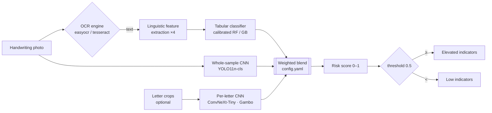
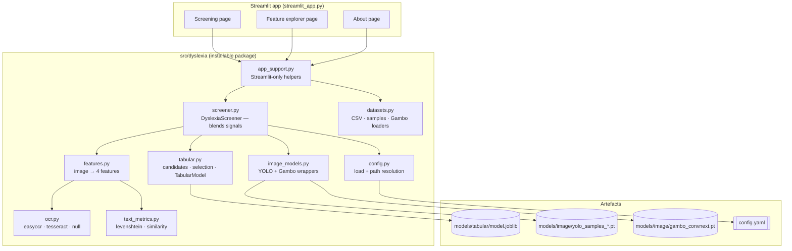
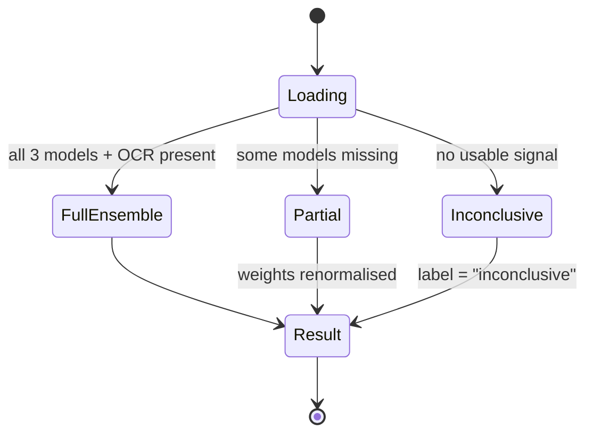
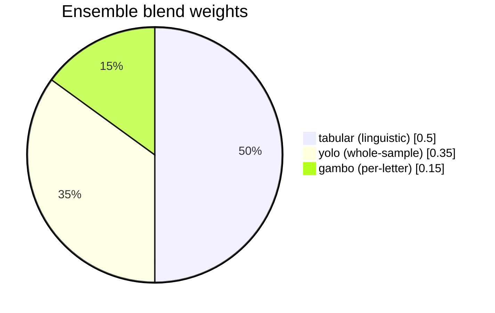
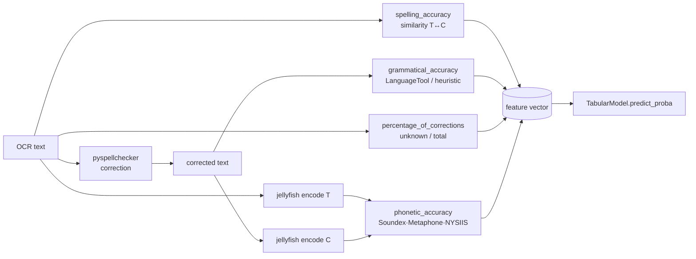
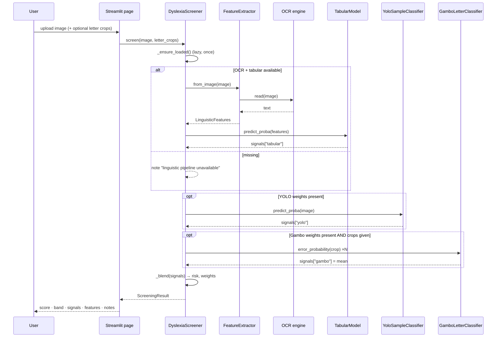
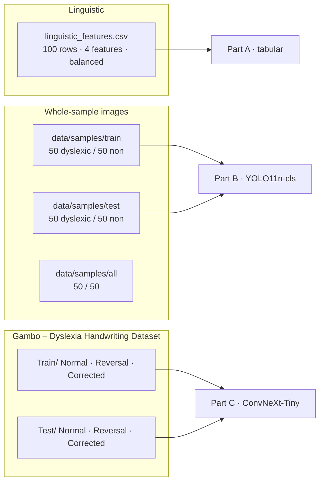
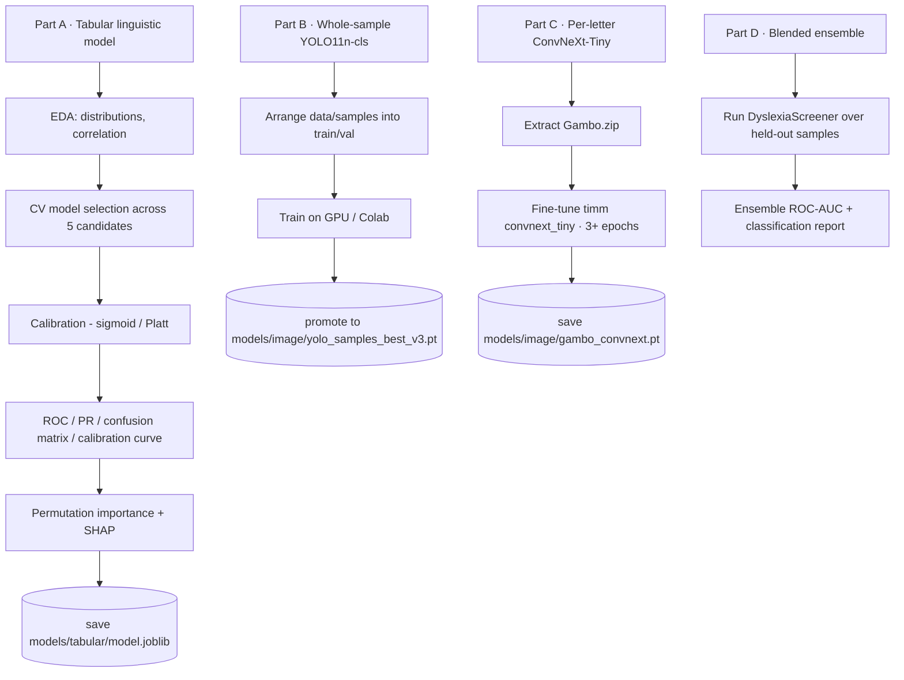
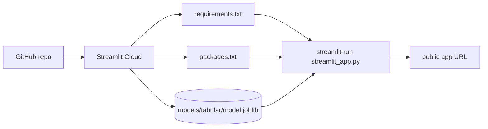

# Dyslexia Detection from Handwriting

> Screening for **dyslexia‑related handwriting patterns** from a single photo of a
> handwriting sample. Originally an AI course project (2024); rebuilt in 2025 with a
> cleaner codebase, fully offline inference, an installable package, a test suite,
> and an ensemble of three independent models.

<p align="center">
  
  
  
  
  
</p>

> [!WARNING]
> **This is a research demo, not a medical device.**
> A dyslexia diagnosis requires a full assessment by a qualified professional.
> Every output here is a rough, exploratory indicator only. Do not use it to make
> educational, clinical, or personal decisions.

---

## Table of contents

- [Overview](#overview)
- [How it works](#how-it-works)
- [System architecture](#system-architecture)
- [The three signals](#the-three-signals)
- [The linguistic features](#the-linguistic-features)
- [Screening flow](#screening-flow)
- [Ensemble & risk scoring](#ensemble--risk-scoring)
- [Datasets](#datasets)
- [Model performance](#model-performance)
- [Quick start](#quick-start)
- [Configuration](#configuration)
- [Project layout](#project-layout)
- [The training notebook](#the-training-notebook)
- [Testing & quality](#testing--quality)
- [Deployment](#deployment)
- [Changes from the 2024 version](#changes-from-the-2024-version)
- [Limitations & ethics](#limitations--ethics)
- [Roadmap](#roadmap)
- [Contributing](#contributing)
- [License](#license)
- [Acknowledgements](#acknowledgements)

---

## Overview

`DyslexiaScreener` takes a handwriting image and blends **up to three independent
model signals** into one risk score in `[0, 1]`. Each signal is optional: if a
model or its dependencies are missing, that signal is dropped and the remaining
blend weights are renormalised — the app still runs.

| | |
|---|---|
| **Input** | One photo of handwriting (a sentence or short paragraph). Optionally, individual letter crops. |
| **Output** | A blended risk score, a band (Low / Some / Elevated), per‑signal probabilities, the OCR'd text, and the 4 linguistic features. |
| **Runs** | Fully offline. No API keys, no network calls (after a one‑time OCR weights download). |
| **Interface** | A 3‑page Streamlit app: *Screening*, *Feature explorer*, *About & methodology*. |
| **Reproducible** | `notebooks/dyslexia_modeling.ipynb` trains and evaluates every model; `scripts/train_tabular.py` rebuilds the committed tabular artefact. |

---

## How it works



---

## System architecture



**Design principle — graceful degradation.** Every optional model and dependency
is wrapped so it degrades to a disabled feature instead of crashing the app. The
`ruff` config even whitelists broad `except Exception` blocks for this reason.



---

## The three signals

| Signal | Model | Backbone | Input | Output used by the blend |
|---|---|---|---|---|
| **Linguistic** | Calibrated classifier (auto‑selected) | RandomForest / GradientBoosting / XGBoost / LogReg / SVM‑RBF | 4 numeric features from OCR'd text | `P(dyslexia)` |
| **Whole‑sample** | `YOLO11n-cls` (transfer‑learned; 2024 YOLOv8n‑cls weights as fallback) | Ultralytics CNN | The full handwriting image | `P(class = "dyslexic")` |
| **Per‑letter** *(optional)* | `ConvNeXt-Tiny` fine‑tuned on the Gambo *Dyslexia Handwriting Dataset* | `timm` ConvNeXt | Individual letter crops → `Normal` / `Reversal` / `Corrected` | mean `1 − P(Normal)` across crops |

Default blend weights (`config.yaml`):



---

## The linguistic features

Four features, computed **entirely offline**, in the fixed column order the tabular
model expects (do **not** reorder — see `config.yaml`):

| # | Feature | What it measures | How it's computed |
|---|---|---|---|
| 1 | `spelling_accuracy` | How close the raw writing is to correctly spelled text | Levenshtein similarity between the OCR text and its spell‑corrected version × 100 |
| 2 | `grammatical_accuracy` | How few word‑level grammatical edits it needs | `language_tool_python` if a JRE is present, else a heuristic (repeated words, lowercase sentence starts) |
| 3 | `percentage_of_corrections` | Share of tokens a proof‑reader would flag | `len(unknown tokens) / len(tokens) × 100` via `pyspellchecker` |
| 4 | `phonetic_accuracy` | How well misspellings still "sound right" | Weighted Soundex (0.4) + Metaphone (0.4) + NYSIIS (0.2) similarity between raw and corrected text × 100 |

All four land on a comparable **0–100** scale.



### Feature separation on the training data

Mean feature value by group (`data/linguistic_features.csv`, n = 100, balanced 50/50):

| Feature | Non‑dyslexic (label 0) | Dyslexic (label 1) | Gap |
|---|---:|---:|---:|
| `spelling_accuracy` | 98.4 | 91.4 | **−7.0** |
| `grammatical_accuracy` | 99.6 | 98.3 | −1.3 |
| `percentage_of_corrections` | 6.8 | 13.0 | **+6.2** |
| `phonetic_accuracy` | 98.9 | 94.0 | **−4.9** |

```text
spelling_accuracy          non-dys │████████████████████████████████████████│ 98.4
                               dys │█████████████████████████████████████   │ 91.4

grammatical_accuracy       non-dys │████████████████████████████████████████│ 99.6
                               dys │███████████████████████████████████████ │ 98.3

percentage_of_corrections  non-dys │████                                    │  6.8
                               dys │████████                                │ 13.0   (higher = more dyslexia-like)

phonetic_accuracy          non-dys │████████████████████████████████████████│ 98.9
                               dys │██████████████████████████████████████  │ 94.0
```

---

## Screening flow



---

## Ensemble & risk scoring

The blend renormalises over **only the signals that fired**:

```
active_weights = { k: config.weights[k] for k in signals }
total          = sum(active_weights.values())
risk           = Σ  signals[k] · (active_weights[k] / total)
```

If no configured weight applies, it falls back to a plain mean. If no signal
fires at all, the label is `"inconclusive"`.

### Risk bands (UI)

| Band | Range | Colour | Meaning |
|---|---|---|---|
| **Low indicators** | `0.00 – 0.34` | 🟢 green | Nothing notable in this sample |
| **Some indicators** | `0.34 – 0.66` | 🟡 amber | Mixed signals |
| **Elevated indicators** | `0.66 – 1.00` | 🔴 red | Worth a proper assessment |

Decision label (`ScreeningResult.label`) uses a single cut at
`ensemble.decision_threshold` (default `0.5`): `≥` → *elevated indicators*,
`<` → *low indicators*.

### Worked example

| Signal | `P(dyslexia)` | Configured weight | Renormalised weight | Contribution |
|---|---:|---:|---:|---:|
| tabular | 0.80 | 0.50 | 0.588 | 0.470 |
| yolo | 0.60 | 0.35 | 0.412 | 0.247 |
| gambo | *(no crops)* | 0.15 | — | — |
| **Blended risk** | | | | **0.718 → Elevated** |

---

## Datasets



| Dataset | Location | Size | Labels | Used by |
|---|---|---|---|---|
| Linguistic features | `data/linguistic_features.csv` | 100 rows (50/50) | `presence_of_dyslexia ∈ {0,1}` | Tabular model (Part A) |
| Handwriting samples | `data/samples/{all,train,test}/` | 100 per split (50 dyslexic / 50 non) | folder name | Whole‑sample CNN (Part B) |
| Gambo letters | `data/gambo/Gambo/{Train,Test}/` | thousands of letter crops | `Normal` / `Reversal` / `Corrected` | Per‑letter CNN (Part C) |
| Word lists | `data/vocab/` | — | — | Legacy pronunciation/dictation tests only |

> [!NOTE]
> **Feature drift.** `linguistic_features.csv` was generated in 2024 with the
> Azure Read API + Bing Spell‑Check + `abydos`. The current extractors
> (`easyocr` + `pyspellchecker` + `jellyfish`) produce values on a comparable
> 0–100 scale but not identical. Part A of the notebook has an opt‑in cell to
> regenerate the table from the raw images with the offline pipeline and retrain.

The Gambo dataset is **not committed** as a zip — place `Gambo.zip` (Kaggle
"Dyslexia Handwriting Dataset") at the repo root and `datasets.prepare_gambo()`
extracts it to `data/gambo/` idempotently.

---

## Model performance

### Tabular model — 5‑fold CV (ROC‑AUC) during model selection

| Candidate | CV ROC‑AUC |
|---|---:|
| **random_forest** ✅ *(selected)* | **0.972** |
| svm_rbf | 0.972 |
| logistic_regression | 0.969 |
| gradient_boosting | 0.969 |
| xgboost | 0.969 |

```text
random_forest        │██████████████████████████████████████ 0.972
svm_rbf              │██████████████████████████████████████ 0.972
logistic_regression │█████████████████████████████████████  0.969
gradient_boosting   │█████████████████████████████████████  0.969
xgboost             │█████████████████████████████████████  0.969
                    └────────────────────────────────────────
                    0.90                                 1.00
```

Hold‑out (20 rows, stratified): ROC‑AUC **1.000**, precision/recall/F1 **1.000**.

> [!IMPORTANT]
> These numbers come from a **tiny, clean, non‑representative** dataset
> (~100 rows). A near‑perfect hold‑out score reflects how separable this
> particular sample is — **not** real‑world screening accuracy. Treat them as a
> sanity check on the pipeline, nothing more.

### Reproduce

```bash
python scripts/train_tabular.py
# CV ROC-AUC by candidate: … -> selected: random_forest
# Hold-out ROC-AUC: 1.000
# saved -> models/tabular/model.joblib
```

The committed `models/tabular/model.joblib` is a `TabularModel` dataclass
(pipeline + provenance: `algorithm`, `trained_at`, CV metrics). A joblib pickle
is tied to the scikit‑learn version that created it — train and run the app in
the same environment (`requirements.txt`), or rebuild with the script above.

---

## Quick start

```bash
# 1. environment
python -m venv .venv
source .venv/bin/activate            # Windows: .venv\Scripts\activate

# 2. install
pip install -r requirements.txt
pip install -e .                     # exposes the `dyslexia` package

# 3. (re)build the tabular model artefact
python scripts/train_tabular.py      # writes models/tabular/model.joblib

# 4. run the app
streamlit run streamlit_app.py
```

The first screening run downloads the EasyOCR weights (~100 MB) once, then works
offline.

### Install profiles

| Goal | Command |
|---|---|
| Just the app (runtime) | `pip install -r requirements.txt` |
| Package + core only | `pip install -e .` |
| + app UI | `pip install -e ".[app]"` |
| + offline NLP features | `pip install -e ".[nlp]"` |
| + OCR (pulls torch) | `pip install -e ".[ocr]"` |
| + image models | `pip install -e ".[vision]"` |
| + SHAP explanations | `pip install -e ".[explain]"` |
| + dev tooling | `pip install -e ".[dev]"` |
| Everything | `pip install -e ".[app,nlp,ocr,vision,explain,dev]"` |

---

## Configuration

Everything is driven by `config.yaml` (paths are resolved to absolute against the
repo root by `config.load_config()`):

| Key | Default | Purpose |
|---|---|---|
| `paths.*` | `data/…`, `models/` | Dataset & artefact locations |
| `ocr.engine` | `easyocr` | `easyocr` \| `tesseract` \| `null` |
| `ocr.languages` | `[en]` | OCR language codes |
| `ocr.min_confidence` | `0.30` | Drop OCR tokens below this confidence |
| `features.names` | 4 features | Column order the tabular model expects — **do not reorder** |
| `tabular.model_path` | `models/tabular/model.joblib` | Where `TabularModel` is persisted |
| `tabular.target` | `presence_of_dyslexia` | Label column |
| `tabular.test_size` / `cv_folds` / `random_state` | `0.2` / `5` / `42` | Training split |
| `image.yolo_weights` | `models/image/yolo_samples_best_v3.pt` | Whole‑sample CNN |
| `image.gambo_weights` | `models/image/gambo_convnext.pt` | Per‑letter CNN |
| `image.gambo_classes` | `[Corrected, Normal, Reversal]` | Class order |
| `image.img_size` | `224` | CNN input size |
| `ensemble.weights` | `tabular 0.5 · yolo 0.35 · gambo 0.15` | Blend weights (renormalised over active signals) |
| `ensemble.decision_threshold` | `0.5` | Cut for the `elevated` / `low` label |

---

## Project layout

```
config.yaml                  central config (paths, OCR engine, blend weights)
streamlit_app.py             app entry point (st.navigation)
pyproject.toml               package metadata + optional-dependency groups
requirements.txt             runtime deps for the Streamlit app
packages.txt                 apt packages for Streamlit Community Cloud

app_pages/
  screening.py               upload → run DyslexiaScreener → show result
  dataset.py                  feature explorer over linguistic_features.csv
  about.py                    methodology, limitations, live pipeline status

notebooks/
  dyslexia_modeling.ipynb     trains & evaluates all 3 models + the ensemble

scripts/
  train_tabular.py            model selection + persistence for the tabular model

src/dyslexia/
  config.py                   config load + path resolution
  ocr.py                      pluggable offline OCR (easyocr / tesseract / null)
  text_metrics.py             levenshtein & similarity helpers (no deps)
  features.py                 image → 4 linguistic features
  tabular.py                  candidate pipelines, CV selection, TabularModel
  image_models.py             YOLO + Gambo wrappers (degrade gracefully)
  screener.py                 DyslexiaScreener — blends the signals
  datasets.py                 CSV / sample / Gambo loaders
  app_support.py              Streamlit-only helpers (bands, caching, labels)

data/
  linguistic_features.csv     100 labelled feature rows
  samples/{all,train,test}/   handwriting images (dyslexic / non_dyslexic)
  gambo/                      extracted from Gambo.zip by prepare_gambo()
  vocab/                      word lists (legacy pronunciation/dictation tests)

models/
  tabular/model.joblib        committed, ready to use
  image/yolo_samples_*.pt     2024 YOLOv8-cls weights (fallback for v1/v2/v3)

tests/                        pytest suite (no heavy deps required)
legacy/                       the untouched 2024 app.py, app2.py, notebooks, runs
```

---

## The training notebook

`notebooks/dyslexia_modeling.ipynb` is the single source of truth for training.
All reusable logic lives in `src/dyslexia/`; the notebook is orchestration +
analysis only.



| Part | Model | Data | Where to run |
|---|---|---|---|
| **A** | Tabular classifier over 4 linguistic features | `data/linguistic_features.csv` | Anywhere (CPU) |
| **B** | Whole‑sample image classifier (YOLO11n‑cls) | `data/samples/{train,test}` | GPU / Colab / Kaggle |
| **C** | Per‑letter classifier (ConvNeXt‑Tiny) | Gambo dataset (`Gambo.zip` at repo root) | GPU |
| **D** | Blended ensemble evaluation | held‑out samples | Anywhere |

---

## Testing & quality

```bash
pytest                    # 16 tests across 5 files — no heavy deps required
ruff check .              # lint (line-length 100, py310 target)
ruff format .             # format
```

| Test file | Covers |
|---|---|
| `test_text_metrics.py` | Levenshtein edit distance, similarity ratio |
| `test_features.py` | `FeatureExtractor` on raw text, feature ranges, empty input |
| `test_tabular.py` | Candidate build, `TabularModel` train / save / load / predict |
| `test_screener.py` | Blend maths, renormalisation, missing‑model fallbacks |
| `test_datasets.py` | CSV column‑alias normalisation, sample iteration |

The suite deliberately avoids `torch` / `easyocr` / `ultralytics` so it runs fast
in CI.

---

## Deployment

**Streamlit Community Cloud:**

1. Point the app at `streamlit_app.py`.
2. `requirements.txt` is picked up automatically.
3. `packages.txt` installs apt packages — `tesseract-ocr` (only if you set
   `ocr.engine: tesseract`) and `default-jre` (only for `language_tool_python`
   grammar checking).
4. Commit `models/tabular/model.joblib` (already done). Image model weights are
   large — ship them via Git LFS or a release asset, or run in "features‑only"
   mode.



---

## Changes from the 2024 version

| Area | 2024 | 2025 rebuild |
|---|---|---|
| **Secrets** | Azure Computer Vision keys committed in `app.py` | ❌ removed — offline OCR, no keys |
| **OCR** | Azure Read API (network) | `easyocr` (offline, bundled weights) / `tesseract` |
| **Spell‑check** | Bing Spell‑Check API | `pyspellchecker` |
| **Phonetics** | `abydos` | `jellyfish` (Soundex / Metaphone / NYSIIS) |
| **Tabular model** | Hand‑transcribed decision tree pasted as an if/else ladder | Persisted, calibrated, cross‑validated pipeline + model selection |
| **Code structure** | Logic inside the Streamlit script | Installable `src/dyslexia/` package with a pytest suite |
| **Signals** | Used in isolation | Blended ensemble (linguistic + whole‑sample + per‑letter) |
| **Whole‑sample CNN** | YOLOv8n‑cls | YOLO11n‑cls (v8 weights kept as fallback) |
| **Audio tabs** | Mic‑based pronunciation / dictation tests | Dropped (need local audio hardware; don't run on Streamlit Cloud). Old code preserved under `legacy/` |

---

## Limitations & ethics

- **Not a diagnosis.** A high score means "worth a proper assessment", nothing more.
- **Tiny training data.** ~100 rows for the linguistic model, ~200 images for the
  whole‑sample CNN. Not demographically representative.
- **Proxy features.** OCR errors on messy handwriting feed straight into the
  linguistic features.
- **Feature drift.** The committed CSV predates the current offline extractors
  (see the note under [Datasets](#datasets)).
- **No fairness audit.** The datasets carry no demographic metadata, so bias
  across age, language background, or writing instrument cannot be measured.
- **Handle results with care.** Screening outputs about a child's cognition are
  sensitive. Do not store, share, or act on them without informed consent and a
  professional in the loop.

---

## Roadmap

- [ ] Regenerate `linguistic_features.csv` with the offline pipeline and retrain (closes the drift gap)
- [ ] Ship YOLO11n‑cls + ConvNeXt‑Tiny weights via release assets / Git LFS
- [ ] Automatic letter segmentation so the per‑letter model needs no manual crops
- [ ] Confidence intervals / abstention when signals disagree
- [ ] Larger, consented, demographically annotated dataset
- [ ] CI: `pytest` + `ruff` on every PR

---

## Contributing

See [CONTRIBUTING.md](CONTRIBUTING.md) for setup, coding standards, the test
workflow, and the pull‑request checklist. In short: fork → branch → `pytest` +
`ruff check .` → PR with a clear description.

---

## License

[MIT](LICENSE) © Shaikh Rumman Fardeen. The datasets carry their own terms — the
Gambo *Dyslexia Handwriting Dataset* is distributed under its Kaggle license.

---

## Acknowledgements

- **Gambo — Dyslexia Handwriting Dataset** (Kaggle) for the per‑letter labels.
- [`easyocr`](https://github.com/JaidedAI/EasyOCR), [`pyspellchecker`](https://github.com/barrust/pyspellchecker),
  [`jellyfish`](https://github.com/jamesturk/jellyfish), [`ultralytics`](https://github.com/ultralytics/ultralytics),
  [`timm`](https://github.com/huggingface/pytorch-image-models), [`scikit-learn`](https://scikit-learn.org),
  and [`streamlit`](https://streamlit.io).
- The original 2024 AI course project team, whose work is preserved under `legacy/`.
